<p align="center">
  
</p>

<p align="center">
  
</p>

```bash
fame@github ~ $ ./about.sh
> AI/ML Builder · Full-Stack Developer
> building intelligent products with data, models, and modern web stacks.
```

```bash
fame@github ~ $ ./stack.sh
```

| Group | Stack |
|---|---|
| Languages | Python · JavaScript · C · C++ · Java · SQL |
| Frontend | React · HTML · CSS · GSAP |
| Backend | Node.js · FastAPI |
| AI / ML | Machine Learning · Generative AI · NumPy · Pandas · Scikit-learn |
| Cloud | AWS · Google Cloud |

```bash
fame@github ~ $ ./projects.sh
```

- `Fame-ki-shop` — Full-stack/web project. ([repo](https://github.com/FakerFAME/Fame-ki-shop))
- `Smart India Hackathon freight forecasting concept` — intelligent freight forecasting + vessel chartering decision support.
- `GraphOps / Attack Path security concept` — graph-based attack-path analysis and blast-radius visualization.

<p align="center">
  
</p>

<p align="center">
  
</p>

```bash
fame@github ~ $ ./links.sh
```

[ GitHub ](https://github.com/FakerFAME) · [ LinkedIn ](https://www.linkedin.com/in/fakerfame)

```bash
fame@github ~ $ exit
connection closed.
```
